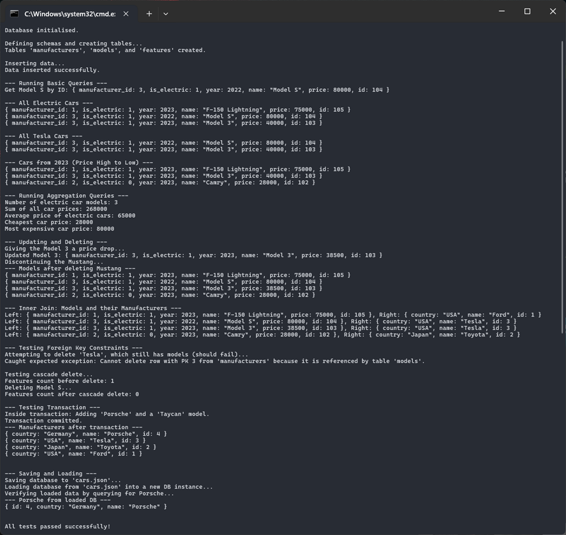

# LightDB — Header-Only C++17 In-Memory Database

[](https://isocpp.org/std/the-standard)
[](https://github.com/aaronmyung/lightDB)
[](LICENSE)

**LightDB** is a modern, header-only C++17 database library for fast, type-safe, in-memory data management with schema enforcement, fluent queries, transactions, and JSON persistence — all in one header, no dependencies beyond [nlohmann/json](https://github.com/nlohmann/json).



---

## Why LightDB?

* **Quick to Start:** Include ldb.hpp and [nlohmann/json](https://github.com/nlohmann/json) for persistence.
* **Schema Enforcement:** Define columns, types, primary keys, and nullability.
* **Fluent Query API:** Chainable `.where()`, `.order_by()`, `.limit()` for expressive queries.
* **ACID-like Transactions:** Automatic rollback on failure.
* **Indexing & Joins:** Accelerated lookups and `INNER`/`LEFT` joins.
* **Aggregations:** Built-in `count`, `sum`, `avg`, `min`, `max`.
* **Persistence:** Save/load the database to JSON.
* **Thread-Safe:** Mutex-protected operations.
* **Extensible Types:** Register custom serialisable data types.

---

## Quick Start

**Install**

```bash
# Download ldb.hpp and json.hpp into your include path
```

**Example**

```cpp
#include "ldb.hpp"
#include "json.hpp"

ldb::LightDB db;

// Schema
ldb::Schema manufacturers("id");
manufacturers.add_field<std::string>("name").add_field<std::string>("country");
db.create_table("manufacturers", manufacturers);

// Insert
auto* table = db.get_table("manufacturers");
table->create_row(db)
    .set("id", 1)
    .set("name", "Tesla")
    .set("country", "USA")
    .insert();

// Query
auto results = table->query(db).where("country").equals("USA").execute();
for (auto& row : results) std::cout << row << std::endl;
```

---

## Feature Overview

| Feature           | Details                                  |
| ----------------- | ---------------------------------------- |
| **Header-Only**   | One file: `ldb.hpp`                      |
| **In-Memory**     | No external DB server                    |
| **Schema Safety** | Enforce types, nullability, primary keys |
| **Indexing**      | Per-field indexing for fast lookups      |
| **Joins**         | `INNER` / `LEFT` joins                   |
| **Transactions**  | Commit/rollback support                  |
| **Persistence**   | Human-readable JSON dump/load            |
| **Aggregation**   | `count`, `sum`, `avg`, `min`, `max`      |

---

## Full Example

See [test.cpp](tests/test.cpp) for a complete demo covering:

* Schema design with indices & foreign keys
* Insert, update, delete
* Complex queries with conditions and sorting
* Aggregations
* Joins
* Transactions
* Saving/loading

**Build & Run**

```bash
g++ -std=c++17 -o test_ldb test.cpp
./test_ldb
```

---

## License

Licensed under the [MIT LICENSE](LICENSE)